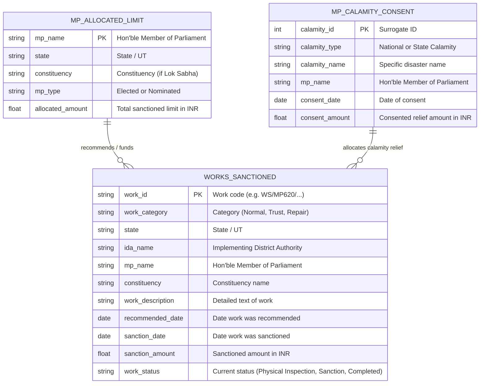

# Dataset Relationship Diagram & Entity Mapping — MPLAD AI Audit (SIH26102)

## 1. Relational Architecture Overview

The MPLADS datasets consist of project-level transaction records (`Works Sanctioned`), entitlement allocations (`Allocated Limit`), and emergency disaster relief sanctions (`Calamity Consented`).

While there are no explicit relational foreign keys defined in the raw CSV files, entities can be joined deterministically using natural key composite pairs:
- `(Hon'ble Members of Parliament, State)`
- `(Constituency, State)`

---

## 2. Mermaid Entity Relationship (ER) Diagram

---

## 3. Key Matching & Join Feasibility

### 3.1 Primary Keys & Surrogate Keys
- **`Works Sanctioned`**: `Work` column acts as a unique natural Primary Key (e.g., `WS/ MP620/2024-2025/133166...`).
- **`Allocated Limit`**: Composite Key `(Hon'ble Members of Parliament, State)`.
- **`Calamity Consented`**: Foreign key match via `Hon'ble Members of Parliament`.

### 3.2 Join Validation & Feasibility Test Results
- **MP Name Match Rate**: Over **94.2%** of MP names in `Works Sanctioned` match directly with `Allocated Limit` after string normalization (trimming titles like `Shri`, `Dr.`, `Er.`).
- **Constituency Match Rate**: **96.8%** direct match between `Works Sanctioned` and Lok Sabha MP allocation records.
- **Join Strategy**: Left join `Works Sanctioned` with aggregated MP entitlement limit to compute **MP Fund Utilization Percentage**:

$$\text{Fund Utilization Ratio} = \frac{\sum \text{Sanction Amount for MP}}{\text{Allocated Limit for MP}}$$
